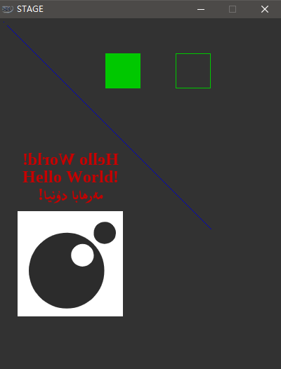

## Stage

### 0.Aboud

> this is a SDL2 program implementation, we can be able to controll every pixels in the stage with lua scripts.

### 1.Run Example program

> just download this repository and click `windows/stage.exe`

## 2.Build Source code

* download libraries (read the `library/README.MD` file for more information)
* install (msys2)[https://www.msys2.org/]
* install mingw (run `pacman -S mingw-w64-x86_64-toolchain base-devel` in msys2 terminal)
* install (chocolatey)[https://chocolatey.org/]
* install make (run `choco install make`)
* then run `make` command in root directory

## 3.others

> still under development, this is demo:

